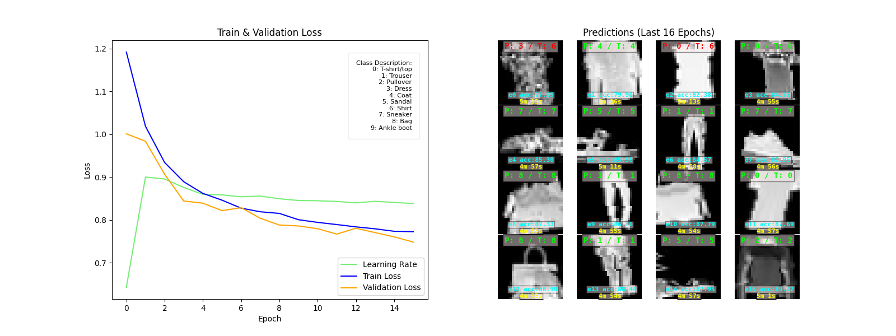
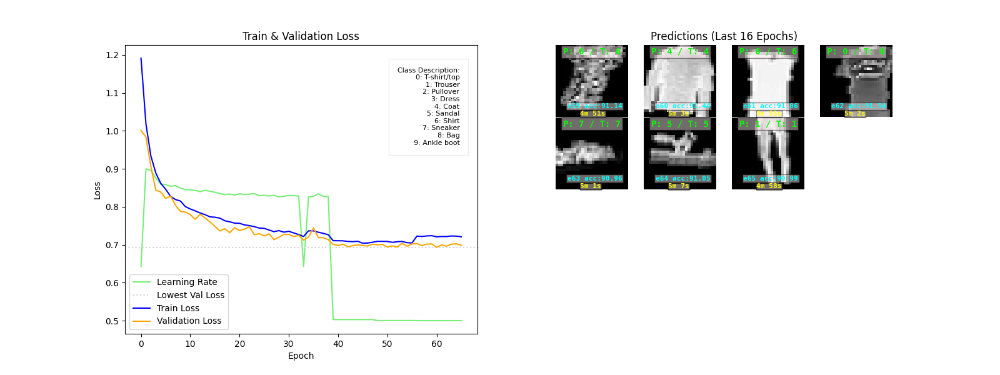

# Proyecto: Clasificación de Fashion MNIST

Este proyecto entrena un modelo de deep learning para clasificar prendas de ropa de Fashion MNIST en 10 clases diferentes. A lo largo del desarrollo, se implementaron varias técnicas para optimizar el desempeño del modelo y superar sus límites iniciales. Este README explica las decisiones tomadas y por qué son útiles para resolver este problema, especialmente para principiantes en Python y deep learning.

---

## 1. **Descripción del Problema**
El conjunto de datos Fashion MNIST contiene 60,000 imágenes de entrenamiento y 10,000 de prueba de prendas de ropa, clasificadas en 10 clases:

- 0: Camiseta/Top
- 1: Pantalón
- 2: Suéter
- 3: Vestido
- 4: Abrigo
- 5: Sandalia
- 6: Camisa
- 7: Zapatilla
- 8: Bolsa
- 9: Botín

El objetivo es construir un modelo que pueda clasificar correctamente estas imágenes.

---

## 2. **Métodos Utilizados para Mejorar el Modelo**

### 2.1 Manejo de Clases Difíciles o Desbalanceadas
Algunos errores frecuentes del modelo ocurrían entre clases similares, como "Camiseta" (0), "Camisa" (6) y "Pantalón" (1). Para mitigar esto:

- **Función de pérdida ponderada**: Ajustamos los pesos de las clases para que el modelo preste más atención a las clases difíciles o menos representadas.
  ```python
  from torch.nn import CrossEntropyLoss

  class_weights = torch.tensor([1.0, 1.0, 1.2, 1.0, 1.0, 1.0, 1.5, 1.0, 1.0, 1.0])
  criterion = CrossEntropyLoss(weight=class_weights)
  ```
- **Sobremuestreo**: Aumentamos la cantidad de datos de las clases difíciles duplicando o generando nuevas muestras artificiales.

### 2.2 Mejoras en los Datos de Entrenamiento

Usamos técnicas de aumento de datos para mejorar la capacidad del modelo de generalizar:

- **Rotación, escalado y traslación**: Estas transformaciones generan versiones ligeramente diferentes de las imágenes originales.
  ```python
  train_transform = transforms.Compose([
      transforms.RandomHorizontalFlip(),
      transforms.RandomRotation(12),
      transforms.RandomAffine(0, translate=(0.15, 0.15), shear=15, scale=(0.85, 1.15)),
      transforms.RandomResizedCrop(28, scale=(0.85, 1.0), ratio=(0.9, 1.05)),
      transforms.ToTensor(),
      transforms.Normalize((0.5,), (0.5,))
  ])

  val_transform = transforms.Compose([
      transforms.ToTensor(),
      transforms.Normalize((0.5,), (0.5,))
  ])
  ```

### 2.3 Arquitectura del Modelo

1. **Bloques SE**: Estos ayudan al modelo a enfocar su atención en las características más relevantes de cada canal de la imagen.
3. **Modelos más profundos**: Experimentamos con arquitecturas más profundas, como ResNet18, para mejorar la capacidad del modelo.

### 2.4 Ajuste de Hiperparámetros
- **Batch size**: Probamos diferentes tamaños (16, 64) para mejorar la estabilidad del entrenamiento.
- **Optimizadores**: Probamos AdamW y SGD con momentum para encontrar el mejor ajuste.
- **Learning rate scheduler**: Ajustamos la tasa de aprendizaje automáticamente y manualmente durante el entrenamiento para evitar quedarse atascados en óptimos locales, intercambiando planificadores de learning rate para probar diferentes comportamientos de aprendizaje.

### 2.5 Distilación de Conocimiento
Entrenamos un modelo más grande ("maestro") y usamos sus predicciones para guiar a nuestro modelo final ("estudiante"). Esto mejora el aprendizaje del modelo pequeño sin necesidad de entrenarlo desde cero.

### 2.6 Transfer Learning
Usamos modelos preentrenados (como ResNet) y los ajustamos finamente a Fashion MNIST para aprovechar patrones ya aprendidos en otras tareas.

---

## 3. **Resultados Obtenidos**
- Precisión máxima alcanzada en CNN: **91.39%**.
- Mejor pérdida de validación en CNN: **0.6940**.
- Gráficas de pérdida y precisión muestran que el modelo se acerca a su límite en esta configuración, pero las mejoras aplicadas ayudaron a estabilizar el entrenamiento y evitar el sobreajuste.

<!-- include image from last training kaggle/fashion-mnist/cnnv4/epoch_66_plot-cnn-v4.png  -->



---

## 4. **Conclusión**
Este proyecto demuestra cómo aplicar técnicas avanzadas de deep learning y optimización para resolver un problema clásico de clasificación de imágenes. Las decisiones tomadas, como el manejo de clases difíciles, el aumento de datos y el ajuste de hiperparámetros, son estrategias importantes para cualquier principiante que busque aprender y mejorar en este campo.

Si tienes dudas o sugerencias, ¡no dudes en contribuir! 🚀

